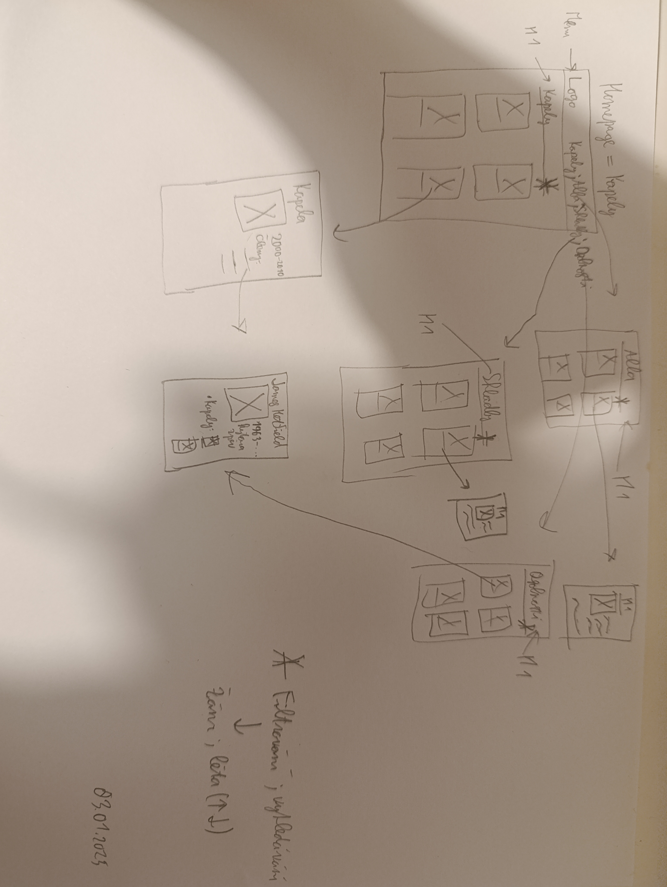

# Metal Detector

*Autor: Illia Husak <illia.husak.s@gyarab.cz>*

## Odborný článek

Metal Detector je webová aplikace, která umožňuje uživatelům prohlédnout si seznam metalových kapel, alb a skladeb.

V administraci lze spravovat databázi kapel. Každá kapela má název, hodnocení, popis, roky tvorby, žánry a obrázek (plakát). Kapela má také seznam členů. Každé album obsahuje seznam skladeb.

Na homepage se nachází seznam kapel, který lze filtrovat (podle žánru) a řadit (podle hodnocení a roku). Seznam kapel je zobrazen ve formě kartiček, na kterých se nachází titulní obrázek kapely, název, žánry a prvních 200 znaků popisu. Kliknutím na kartičku se otevře stránka s detailem kapely, kde jsou uvedeny všechny atributy kapely.

Z detailu kapely je možné kliknout na žánr (který vede na homepage s vyfiltrovaným seznamem kapel podle žánru) nebo na člena kapely (který vede na detail dané osoby).

Detail osoby zobrazuje jméno, rok narození, fotografii a popis. Dále se zde nachází seznam kapel, ve kterých daná osoba hrála, a odkazy vedoucí na detail kapely. Podobně to funguje i s alby a skladbami.

## Wireframes

